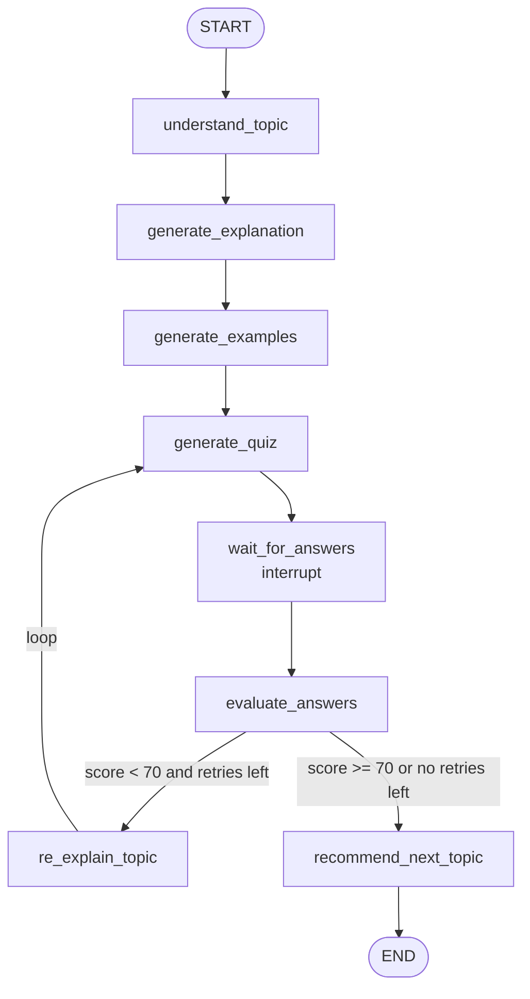
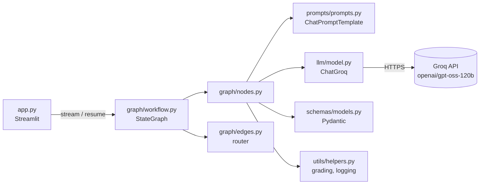

# AI Study Assistant

An interactive study app built with **LangChain + LangGraph + Groq + Streamlit**.

You type a topic, and the assistant explains it, gives examples, quizzes you,
grades your answers and then **decides what to do next**: re-explain it more
simply if you struggled, or recommend a next topic if you passed.

The main purpose of this project is to **learn LangChain and LangGraph** by building
something real. Every file is small and heavily commented.
After reading this README, open **[LEARNING_GUIDE.md](LEARNING_GUIDE.md)** for a file-by-file walkthrough.

---

## 1. What the project does

1. **Understands** your topic (clean title, key concepts, prerequisites)
2. **Explains** it at a beginner level (definition, why it matters, how it works, analogy)
3. **Generates 2–4 examples**
4. **Generates a 5-question quiz** (4 options each)
5. **Waits** while you answer in the browser
6. **Evaluates** your answers (score in Python, feedback from the LLM)
7. **Routes** based on the score:
   - **< 70%** → re-explains more simply and gives a **shorter 3-question quiz** (max 2 retries)
   - **≥ 70%** (or out of retries) → **recommends the next topic**

## 2. Why LangChain?

LangChain gives us standard building blocks for talking to LLMs:

| Building block | Where we use it |
|---|---|
| `ChatGroq` chat model | [llm/model.py](llm/model.py) |
| `ChatPromptTemplate` | [prompts/prompts.py](prompts/prompts.py) |
| `.with_structured_output(PydanticModel)` | [llm/model.py](llm/model.py) |
| LCEL chains: `prompt \| llm` | [graph/nodes.py](graph/nodes.py) |

Without LangChain we would hand-write HTTP requests, format message lists
ourselves and parse JSON by hand.

## 3. Why LangGraph?

Our app is not a straight line. It has **a pause** (waiting for the student),
**a decision** (pass or fail?) and **a loop** (re-explain → new quiz → evaluate again).

LangGraph lets us describe that as a **state machine**: boxes (nodes) connected
by arrows (edges), with a shared memory (state) flowing through them.
It also gives us **checkpointing** and **interrupts**, so the graph can pause for
the user and continue later.

## 4. LangChain vs LangGraph

| | LangChain | LangGraph |
|---|---|---|
| Main job | Talk to an LLM: prompts, models, parsing | Control the **flow** of a multi-step app |
| Shape | Mostly linear chains: `A \| B \| C` | Graphs with branches, loops and pauses |
| Memory between steps | You pass values manually | A shared, typed **state** |
| Human in the loop | Not built in | `interrupt()` + checkpointer |
| In this project | *Inside* each node | *Between* the nodes |

> Rule of thumb: **LangChain does one step well. LangGraph decides which step runs next.**

## 5. Architecture



How the layers fit together:



### Project structure

```text
ai-study-assistant/
├── app.py                 # Streamlit UI (runs / resumes the graph)
├── requirements.txt
├── .env.example           # copy to .env and add your key
├── README.md
├── LEARNING_GUIDE.md      # file-by-file teaching notes + roadmap
├── graph/
│   ├── state.py           # StudyState (the shared memory) + settings
│   ├── nodes.py           # one function per step
│   ├── edges.py           # routing function for the conditional edge
│   └── workflow.py        # builds and compiles the StateGraph
├── llm/
│   └── model.py           # ChatGroq, ask_llm(), structured output, error handling
├── prompts/
│   └── prompts.py         # one ChatPromptTemplate per task
├── schemas/
│   └── models.py          # Pydantic models for structured output
├── utils/
│   └── helpers.py         # logging, errors, quiz validation & grading
├── ui/
│   ├── theme.py           # global CSS: animations, cards, buttons, quiz options
│   ├── cards.py           # animated HTML cards (st.html, LLM text is escaped)
│   └── three_scenes.py    # Three.js 3D scenes embedded with st.iframe
└── .streamlit/
    └── config.toml        # green color theme
```

### The UI

- **Theme:** `.streamlit/config.toml` sets the green palette (`#4A7023` primary, `#F4F9F1` background).
- **3D scenes (Three.js):** a floating knowledge crystal in the hero, a spinning "thinking" knot while the graph runs,
  an animated score ring with a spinning trophy and confetti (pass) or a growing seedling (retry), a rocket next to the
  recommendation, and an interactive **3D map of the LangGraph workflow** that highlights visited and current nodes (drag to rotate).
- **Animations (CSS):** fade-in cards, a progress stepper, flip cards for examples, pill-style quiz answers, a shaking label on wrong
  answers, and balloons when you pass. Animations turn off if your system has "reduce motion" enabled.
- Three.js loads from cdnjs. Without internet, a CSS 3D cube is shown instead and the rest of the app works normally.

## 6. State

The **state** is a `TypedDict` ([graph/state.py](graph/state.py)) that every node can read.

| Field | Purpose |
|---|---|
| `topic` | What the student typed |
| `topic_analysis` | Clean title, subject, difficulty, key concepts, prerequisites |
| `explanation` | The first explanation |
| `examples` | 2–4 examples |
| `quiz` | The **current** quiz (includes correct answers, never shown before submission) |
| `user_answers` | The student's answers to the current quiz |
| `score` | Latest score (0–100), read by the router |
| `feedback` | Latest overall feedback |
| `weak_concepts` | What the student struggled with (feeds re-explanation and the next quiz) |
| `attempts` | **History** of every graded quiz (uses a reducer, see below) |
| `re_explanations` | **History** of simpler explanations (uses a reducer) |
| `retry_count` | How many times we re-explained; stops the loop |
| `recommendation` / `next_topic` | Final output |

**Partial updates:** nodes return only what they change, e.g. `{"examples": [...]}`.
LangGraph merges that into the state.

**Reducers:** normally a returned value *replaces* the old one. The history fields are
declared as `Annotated[list[dict], operator.add]`, so returning `{"attempts": [new]}`
*appends* to the list instead.

## 7. Nodes

A node is a plain function `state -> partial update`. See [graph/nodes.py](graph/nodes.py).

| Node | Does | Updates |
|---|---|---|
| `understand_topic` | Analyse the request | `topic_analysis` |
| `generate_explanation` | Beginner explanation | `explanation` |
| `generate_examples` | 2–4 examples | `examples` |
| `generate_quiz` | 5 questions (3 on retries), validated | `quiz`, `user_answers` |
| `wait_for_answers` | **Pauses** with `interrupt()` | `user_answers` |
| `evaluate_answers` | Grade in Python + LLM feedback | `score`, `feedback`, `weak_concepts`, `attempts` |
| `re_explain_topic` | Simpler explanation | `re_explanations`, `retry_count` |
| `recommend_next_topic` | Next step or extra guidance | `recommendation`, `next_topic` |

## 8. Edges

Normal edges always go to the same next node:

```python
builder.add_edge(START, "understand_topic")
builder.add_edge("generate_quiz", "wait_for_answers")
builder.add_edge("recommend_next_topic", END)
```

`START` and `END` are special markers imported from `langgraph.graph`.

## 9. Conditional edges

After `evaluate_answers`, a **routing function** picks the next node
([graph/edges.py](graph/edges.py)):

```python
def route_after_evaluation(state) -> Literal["re_explain", "recommend"]:
    if state["score"] >= PASSING_SCORE:
        return "recommend"
    if state["retry_count"] >= MAX_RETRIES:
        return "recommend"          # stop looping, move on with guidance
    return "re_explain"

builder.add_conditional_edges(
    "evaluate_answers",
    route_after_evaluation,
    {"re_explain": "re_explain_topic", "recommend": "recommend_next_topic"},
)
```

The dict maps the router's **labels** to **node names**. It also lets LangGraph draw the graph correctly.

## 10. Loops

```python
builder.add_edge("re_explain_topic", "generate_quiz")
```

That single edge creates a cycle: `generate_quiz → wait → evaluate → re_explain → generate_quiz`.
Cycles are what make LangGraph different from a simple chain. **Every loop needs an exit
condition.** Ours is `retry_count >= MAX_RETRIES`, and `re_explain_topic` increments `retry_count` each time.

## 11. Streamlit interaction

Streamlit **re-runs the whole script on every click**. The key ideas in [app.py](app.py):

1. **Build the graph once:** `@st.cache_resource def get_graph()`.
2. **Run the graph only on buttons:** *Start Learning* and *Submit Quiz*.
3. **Pause with `interrupt()`:** the `wait_for_answers` node calls `interrupt(...)`.
   The graph stops, and the **checkpointer** (`InMemorySaver`) saves the state under a `thread_id`.
4. **Resume with `Command(resume=answers)`:**
   ```python
   graph.stream(Command(resume=answers), {"configurable": {"thread_id": thread_id}})
   ```
   Inside the node, `interrupt()` now *returns* the answers.
5. **Persist a copy in `st.session_state`:** after each run we call `graph.get_state(config)` and store
   the values (topic, explanation, examples, quiz, answers, score, retry count...) in
   `st.session_state.study_state`. Normal re-runs just redraw from it, with **no LLM calls**.
6. **`st.form` for the quiz:** clicking radio buttons doesn't rerun anything until *Submit Quiz*.

`snapshot.next` tells the UI where the graph is:

| `snapshot.next` | Meaning | UI shows |
|---|---|---|
| `("wait_for_answers",)` | paused by interrupt | the quiz form |
| `()` | reached `END` | the recommendation |
| anything else | a node failed | an error + **Retry this step** (`graph.stream(None, config)`) |

## 12. Installation

Requires **Python 3.11+**.

```bash
cd ai-study-assistant
python -m venv .venv

# Windows (PowerShell)
.venv\Scripts\Activate.ps1
# macOS / Linux
source .venv/bin/activate

pip install -r requirements.txt
```

## 13. Environment setup

1. Create a free API key at <https://console.groq.com/keys>
2. Copy the example file:
   ```bash
   # Windows
   copy .env.example .env
   # macOS / Linux
   cp .env.example .env
   ```
3. Edit `.env`. Each graph node that calls Groq has **its own key**, numbered in graph order:

   | Variable | Used by |
   |---|---|
   | `GROQ_API_KEY_1` | `understand_topic` |
   | `GROQ_API_KEY_2` | `generate_explanation` |
   | `GROQ_API_KEY_3` | `generate_examples` |
   | `GROQ_API_KEY_4` | `generate_quiz` (main key) |
   | `GROQ_API_KEY_5` | `generate_quiz` (**backup**, only used if key 4 fails or returns a bad quiz) |
   | `GROQ_API_KEY_6` | `evaluate_answers` |
   | `GROQ_API_KEY_7` | `re_explain_topic` |
   | `GROQ_API_KEY_8` | `recommend_next_topic` |

   `wait_for_answers` doesn't call Groq, so it needs no key.

   ```text
   GROQ_API_KEY_1=gsk_...
   ...
   GROQ_API_KEY_8=gsk_...
   ```

   Only have one key? Set `GROQ_API_KEY=gsk_...` instead. It is used for any numbered key you leave out.

The mapping lives in `NODE_API_KEYS` in [llm/model.py](llm/model.py). Keys are loaded with `python-dotenv` and are
never hard-coded. If any are missing, the app lists exactly which ones instead of crashing.
`.env` is listed in `.gitignore`. **Never put real keys in `.env.example`**, because that file is committed.

## 14. How to run

**The web app:**
```bash
streamlit run app.py
```
Keep the terminal visible to watch the `[GRAPH]`, `[NODE]`, `[ROUTER]` and `[LLM]` logs.

**Learning mode (run each phase on its own), from the project root:**
```bash
python -m llm.model         # Phase 1: a single ask_llm() call
python -m prompts.prompts   # Phase 2: see the messages a prompt template produces
python -m graph.workflow    # The full graph in the terminal (answer quizzes by typing 1-4)
```

## 15. Example usage

1. Type **"What is an embedding?"** and click **Start Learning**.
2. The progress box shows each node finishing:
   Understood the topic → Wrote the explanation → Created examples → Generated a quiz → Paused.
3. Read the explanation and examples, answer the 5 questions, click **Submit Quiz**.
4. Say you score **40%**. You see *"Let's revisit the topic"*, the concepts you struggled with,
   per-question explanations, a **simpler explanation** and a **3-question quiz**.
5. You now score **100%**. You see *"Great job!"* and a recommendation such as
   **Vector Databases**, with the reason why.
6. Click **Start learning: Vector Databases** to begin a new session.

Terminal output for that run:

```text
[GRAPH] Starting workflow
[NODE] Understanding topic
[LLM] Calling Groq for 'topic analysis' (attempt 1/2)
[NODE] Generating explanation
[NODE] Generating examples
[NODE] Generating quiz #1 (5 questions)
[NODE] Waiting for user answers            <- graph pauses
[GRAPH] Resuming workflow with the student's answers
[NODE] Waiting for user answers            <- node re-runs on resume (expected!)
[GRAPH] Resumed with 5 answers
[NODE] Evaluating answers
[NODE] Correct: 2/5 -> score 40%
[ROUTER] Score = 40, retries used = 0/2
[ROUTER] Below 70% -> going to re_explain
[NODE] Re-explaining topic (retry 1/2)
[NODE] Generating quiz #2 (3 questions)
[NODE] Waiting for user answers            <- graph pauses again
...
[ROUTER] Passed -> going to recommend
[NODE] Recommending next topic (passed=True)
[NODE] Next topic: Vector Databases
```

The sidebar also has a **Graph execution log**, the **Raw graph state** (correct answers hidden while
a quiz is open) and a **Reset session** button. At the bottom, **View LangGraph Workflow** shows the
graph as text and Mermaid, and can render an image (needs internet access to mermaid.ink).

## 16. Future improvements

- **Persistent sessions:** swap `InMemorySaver` for `SqliteSaver` so sessions survive restarts
- **Streaming tokens:** show the explanation word by word with `stream_mode="messages"`
- **Difficulty levels:** let the student choose beginner / intermediate / advanced
- **Different question types:** true/false, short answer graded by the LLM
- **Parallel nodes:** generate examples and quiz at the same time (fan-out / fan-in)
- **Subgraphs:** move the quiz loop into its own reusable subgraph
- **Tools / RAG:** let the tutor search the web or your own notes for up-to-date material
- **Learning path:** keep a history of completed topics and build a personal roadmap
- **Tracing:** enable LangSmith to visualise every LLM call and node run
- **Tests:** unit-test nodes with a fake LLM (see how `helpers.py` is kept framework-free)
